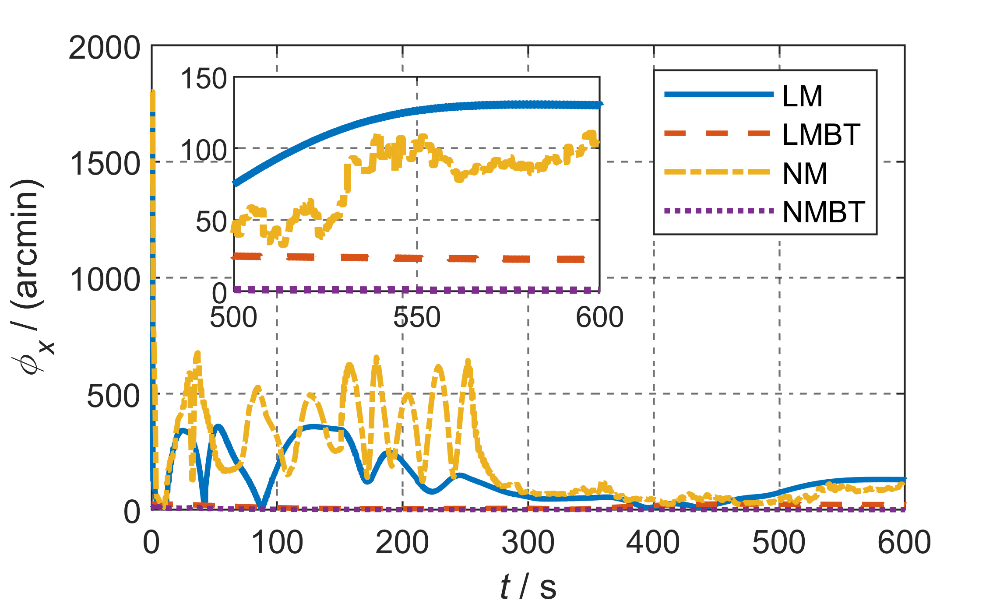

# A GNSS Aided Initial Alignment Method for MEMS-IMU Based on Backtracking Algorithm and Backward Filtering

## Data Introduction
This code library store the simulation result of alignment in the large misalignment condition. _large misalignment_ folder is the result data and the matlab code to compare different algorithm. The other folder is the same.
The source code of these algorithm is based on _psins-toolbox_, so it is not provided at present.

## Simulation Result
The misalignment angles comparison of LM, NM, LMBT, and NMBT algorithms, in the condition that initial misalignment is 30deg,30deg, and 170deg.
 _x-axis misalignment_
 _y-axis misalignment_
 _z-axis misalignment_