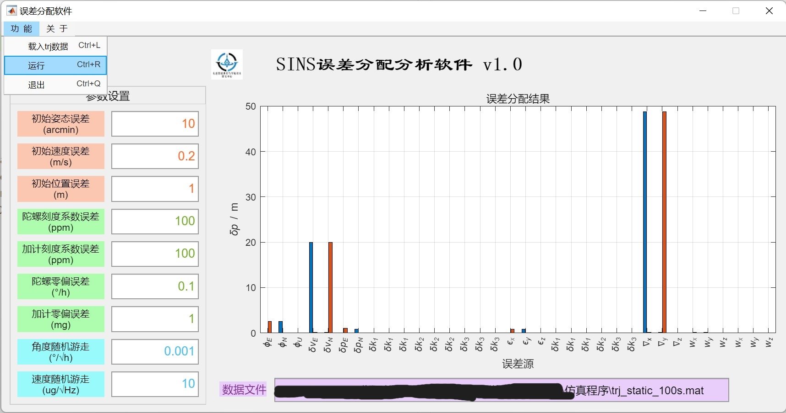

# SINS误差分配分析程序

## 软件介绍
SINS误差分配分析程序的主要功能是根据设置的导航误差参数（初始导航误差、IMU常值误差和IMU随机误差），以及载入的轨迹数据（psins-toolbox中trj结构体格式），完成导航误差分配，得到最终时刻的导航误差分配结果。
软件界面如下：

目前软件仅实现了对于位置误差的显示，后续将加入姿态误差、速度误差的误差分配结果。
软件功能尚不完整，因此暂不公开源码。

## 安装说明
1.打开Matlab，切换到"App"选项卡；
2.点击"安装App";
3.选中发行版安装文件"TrjGeneration.mlappinstall"；
4.在已安装App列表中找到刚安装的应用，打开即可。

## 参考文献
Yang, Xiaokang, Gongmin Yan, Fan Liu, Bofan Guan, and Sihai Li. "Analysis Method of Strapdown Inertial Navigation Error Distribution Based on Covariance Matrix Decomposition." arXiv preprint arXiv:2203.11810 (2022).
